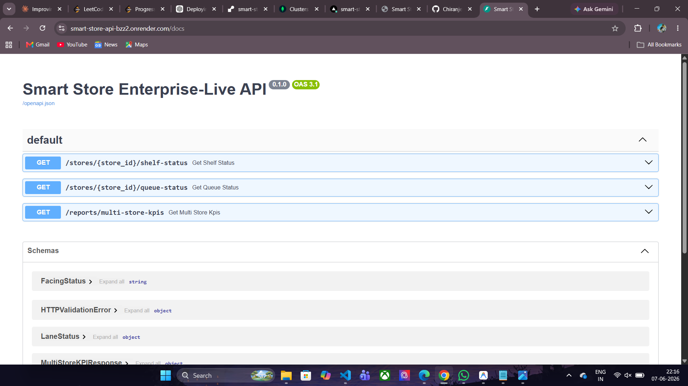
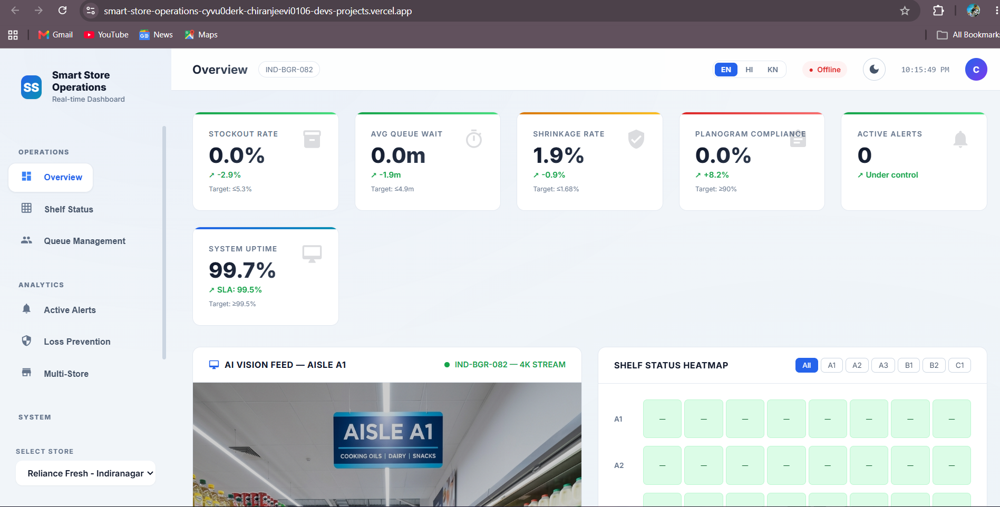
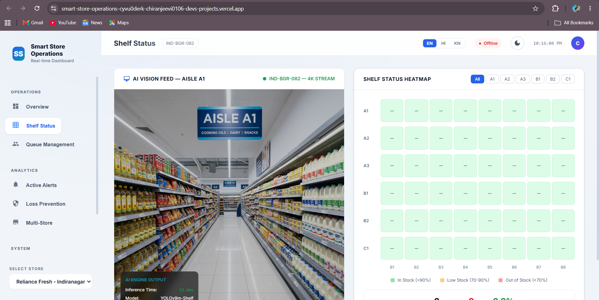
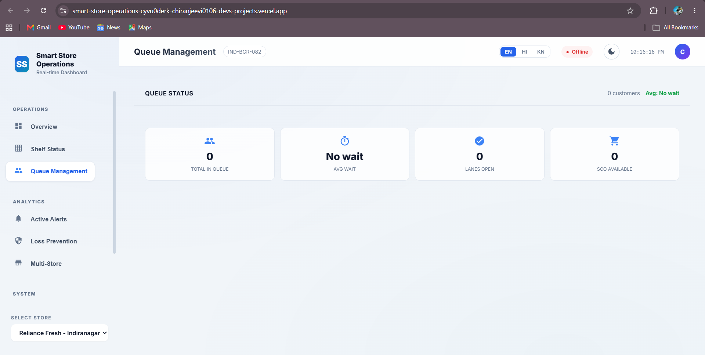

# Smart Store Operations Platform

> **Sensor & Computer Vision Platform for Shelf Availability, Queue Management, and Loss Prevention**

Enterprise-grade retail technology platform for a mid-size grocery chain (8 stores, ~3,500 sq ft each). Uses IoT shelf sensors, RFID, and overhead cameras to automate shelf monitoring, queue management, and loss prevention.

---
## Live Deployment

Dashboard (Frontend)

https://YOUR-VERCEL-URL.vercel.app

API Documentation

https://smart-store-api-bzz2.onrender.com/docs

Backend API

https://smart-store-api-bzz2.onrender.com


## Screenshots

### api-docs


### dashboard


### queue-monitoring


### shelf-monitoring



## 🏗️ Architecture

```
┌──────────────────────────────────────────────────────┐
│                    CLOUD (AWS)                       │
│  ┌──────────┐  ┌──────────────┐  ┌──────────────┐   │
│  │ FastAPI   │  │ TimescaleDB  │  │ S3 Data Lake │   │
│  │ REST/WS   │  │ (hypertable) │  │ + Glue       │   │
│  └─────┬─────┘  └──────┬───────┘  └──────────────┘   │
│        │               │                              │
│  ┌─────┴───────────────┴────────┐                    │
│  │     Kafka / Kinesis          │                    │
│  └──────────────┬───────────────┘                    │
│                 │                                     │
│  ┌──────────────┴───────────────┐                    │
│  │   Grafana + Prometheus       │                    │
│  └──────────────────────────────┘                    │
└──────────────────────┬───────────────────────────────┘
                       │ TLS 1.3
┌──────────────────────┴───────────────────────────────┐
│                 EDGE (per store)                      │
│  ┌──────────┐  ┌──────────────┐  ┌──────────────┐   │
│  │NVIDIA     │  │4K Cameras    │  │Weight Sensors │   │
│  │Jetson     │  │(20/store)    │  │+ RFID Readers│   │
│  │Orin NX ×3 │  │RTSP streams  │  │RS-485/MQTT   │   │
│  └──────────┘  └──────────────┘  └──────────────┘   │
│                                                       │
│  Workloads: YOLOv9 Shelf | RT-DETR Queue | LP CNN   │
│  Buffer: SQLite 24h offline | MQTT local broker      │
└──────────────────────────────────────────────────────┘

┌──────────────────────────────────────────────────────┐
│              FRONTEND (React + Vite)                  │
│  Manager Dashboard | Staff PWA | i18n (EN/HI/KN)    │
│  WebSocket real-time alerts | Role-based access      │
└──────────────────────────────────────────────────────┘
```

---

## 📁 Project Structure

```
MINI_PROJECT/
├── cloud/
│   ├── api/                     # FastAPI cloud REST + WebSocket API
│   │   ├── main.py              # API server (shelf, queue, alerts, KPIs)
│   │   ├── Dockerfile
│   │   └── requirements.txt
│   ├── timeseries/
│   │   └── schema.sql           # TimescaleDB hypertables + aggregates
│   └── observability/
│       └── grafana/provisioning/ # Grafana dashboards + datasources
│
├── dashboard/                   # React + Vite manager dashboard
│   └── src/
│       ├── App.jsx              # Main app with view routing
│       ├── store.js             # Zustand state management
│       ├── useWebSocket.js      # WebSocket hook with auto-reconnect
│       ├── i18n.js              # EN / HI / KN translations
│       ├── index.css            # Dark theme design system
│       └── components/
│           ├── Sidebar.jsx      # Navigation + role/store selector
│           ├── Header.jsx       # Title, language, connection status
│           ├── KPICards.jsx      # 6 KPI stat cards
│           ├── ShelfHeatmap.jsx  # Interactive aisle×bay heatmap
│           ├── QueuePanel.jsx    # Lane status with progress bars
│           ├── AlertsPanel.jsx   # Filterable alert feed + Ack/Dismiss
│           └── MultiStoreView.jsx# Chain-wide benchmarking table
│
├── docs/
│   ├── phase1-discovery/        # Interview guide, survey, KPI, risk register
│   ├── phase2-hardware/         # Sensor specifications + BoM
│   ├── phase3-infrastructure/   # Network topology, MQTT schema, SLA
│   ├── phase7-lp/               # DPDP privacy compliance
│   └── phase10-launch/          # Rollout checklist + onboarding playbook
│
├── edge/
│   ├── vision/
│   │   ├── inference/
│   │   │   ├── server.py        # FastAPI inference server (YOLOv9 + Siamese)
│   │   │   ├── schemas.py       # Pydantic request/response models
│   │   │   └── alert_publisher.py  # MQTT alert with deduplication
│   │   ├── training/
│   │   │   ├── train_yolov9.py  # Fine-tuning + TensorRT export + MLflow
│   │   │   └── train_planogram.py  # Siamese ResNet-50 training
│   │   └── models/
│   │       └── model_card.md    # ML model card (transparency)
│   ├── queue/
│   │   └── queue_manager.py     # RT-DETR + DeepSORT + wait time + staffing
│   └── loss-prevention/
│       └── lp_pipeline.py       # Behaviour + dwell + RFID + video clip + audit
│
├── infra/
│   ├── terraform/
│   │   └── main.tf              # AWS: VPC, EKS, S3, Kinesis, RDS, Redis, Glue
│   ├── ansible/
│   │   └── edge-provision.yml   # Edge node: hardening, Docker, TLS, watchdog
│   ├── prometheus/
│   │   └── prometheus.yml       # Scrape config for all services
│   └── mosquitto/config/
│       └── mosquitto.conf       # MQTT broker config
│
├── pipelines/
│   └── automation_pipelines.py  # ML retraining, A/B testing, PDF reports, SLA
│
├── services/
│   ├── fusion/
│   │   └── kafka_topology.py    # Bayesian sensor fusion + tumbling windows
│   └── restock/
│       └── restock_service.py   # LSTM prediction + WMS + feedback loop
│
├── docker-compose.yml           # Full local dev stack
└── requirements.txt             # Python dependencies
```

---

## 🚀 Quick Start (Real-Time System)

### 1. Start Infrastructure
```bash
docker-compose up -d
```
This starts: Kafka, TimescaleDB, Redis, MQTT, MLflow, Prometheus, Grafana, and the **DB Persistence Worker**.

### 2. Seed Master Data
```bash
# Initialize aisles, bays, and products in TimescaleDB
python scripts/init_master_data.py
```

### 3. Start Cloud API
```bash
pip install -r requirements.txt
cd cloud/api
python main.py
```
API docs at **http://localhost:8000/docs**

### 4. Start Dashboard
```bash
cd dashboard
npm install
npm run dev
```
Dashboard runs at **http://localhost:5173** (Now uses real REST/WS data)

### 5. Generate Real Data (Optional)
To see the system react to "real" sensor events without physical hardware:
```bash
python scripts/data_feeder.py
```

---

## 🔑 Key Features

| Feature | Technology | Target SLA |
|---------|-----------|------------|
| Shelf out-of-stock detection | YOLOv9-m + sensor fusion | mAP ≥ 0.92, ≤80ms inference |
| Planogram compliance | Siamese ResNet-50 | ≥ 90% compliance |
| Queue wait estimation | RT-DETR + DeepSORT | ≤ 5 min avg wait |
| Loss prevention | MediaPipe + CNN + RFID | ≤ 5% false positive |
| Real-time dashboard | React + WebSocket | ≤ 500ms alert delivery |
| Multi-language | i18n (EN/HI/KN) | All UI strings |
| Privacy compliance | DPDP Act 2023 | Edge-first, face blur |

---

## 📊 Phase Completion

| Phase | Description | Status |
|-------|-------------|--------|
| 1 | Project Discovery & Requirements | ✅ Complete |
| 2 | Hardware Specifications | ✅ Complete |
| 3 | Network & Edge Infrastructure | ✅ Complete |
| 4 | Computer Vision Pipeline | ✅ Complete |
| 5 | Sensor Fusion & Replenishment | ✅ Complete |
| 6 | Queue Management | ✅ Complete |
| 7 | Loss Prevention + Privacy | ✅ Complete |
| 8 | Cloud Platform (API + DB + IaC) | ✅ Complete |
| 9 | Frontend Dashboard (React) | ✅ Complete |
| 10 | Scale, Launch & Automation | ✅ Complete |

---

## 🔒 Security & Compliance

- **TLS 1.3** everywhere (edge↔cloud, MQTT, API)
- **Edge-first processing** — no raw video leaves the device
- **Face anonymization** before any video storage
- **RBAC** — Admin, Store Manager, Cashier, LP Officer roles
- **DPDP Act 2023** compliant — documented in `/docs/phase7-lp/`
- **Immutable audit trail** for all LP actions (append-only table)

---

## 📄 License

Proprietary — Internal use only.
